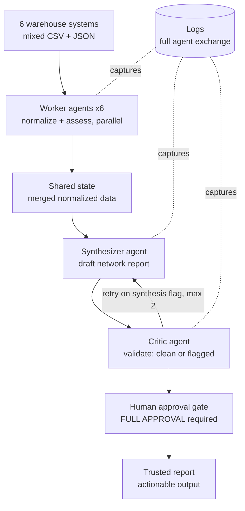

# Cascade Inventory Agents

A multi-agent system that compiles a cross-warehouse inventory report in minutes — work
that currently takes an ops analyst half a day — while keeping a human in control of the
final decision.

## The problem

Cascade Retail's ops analyst checks stock across 6 separate warehouse systems, reconciles
them by hand, and compiles a network report. It's accurate and trusted, but it takes ~4
hours per report and runs several times a week. The goal was to make it faster **without
losing the oversight the manual process provides.**

## What it does

Six warehouse worker agents read their systems in parallel (across three different file
formats), a synthesizer agent reasons across all of them to surface network-wide shortages
and stock imbalances, a critic agent verifies every claim against the source data, and a
human approves the final report before it's trusted. Every step is logged.

## Architecture



Three agent roles, each with its own system prompt, coordinated by a plain-Python
orchestrator:

- **Worker** (×6, parallel) — normalizes one warehouse's data to a common schema and flags
  objectively impossible values. Handles standard CSV, legacy-named CSV, and JSON.
- **Synthesizer** — reasons across all six to produce the network report: shortages,
  imbalances, and forwarded data issues.
- **Critic** — verifies the report against the source data, returns `clean` or `flagged`,
  and classifies each issue as retry-fixable or not.

## Oversight design

The human approval gate is the checkpoint kept from the manual process. The system does the
gathering and reasoning; the human owns the decision. The critic labels each report
`clean`/`flagged`, and the retry loop only re-runs the synthesizer for *synthesis* errors —
source-data problems (e.g. a negative quantity) are escalated to the human, never retried.
This ships at Full Approval and is designed to drop to exception-only review as the critic
earns a track record.

A sample run showing the full exchange — including the system catching and correcting its
own error before a human saw it — is in [`docs/sample_run.json`](docs/sample_run.json).

## Running it

```bash
python -m venv .venv
.venv\Scripts\Activate.ps1        # Windows
pip install -r requirements.txt
```

Add your key to a `.env` file in the project root:

ANTHROPIC_API_KEY=sk-ant-...

Then run the full pipeline:

```bash
python main.py
```

It gathers all six warehouses, synthesizes and critiques the report, retries if needed,
and pauses for your approval.

## Project structure

- `agents/worker.py` — warehouse normalization agent
- `agents/orchestrator.py` — runs the six workers in parallel
- `agents/synthesizer.py` — cross-warehouse reasoning
- `agents/critic.py` — grounded verification
- `agents/approval.py` — human approval gate
- `agents/logger.py` — full-exchange logging
- `main.py` — end-to-end pipeline with retry loop
- `data/` — six simulated warehouse files (mixed formats)

## Notes

Built as a solo portfolio project. The warehouse data is simulated, with deliberately mixed
formats and seeded signals (a network-wide shortage, a stock imbalance, and a data-quality
error) to exercise each agent.

See [`docs/BEFORE_AFTER.md`](docs/BEFORE_AFTER.md) for the full business case and before/after analysis.


Built by [Jeffrey](https://github.com/Oaazu) as a solo portfolio project.